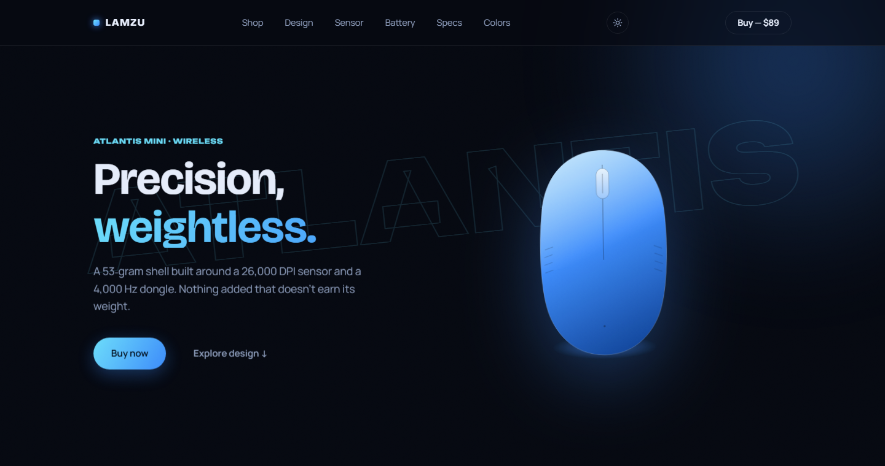
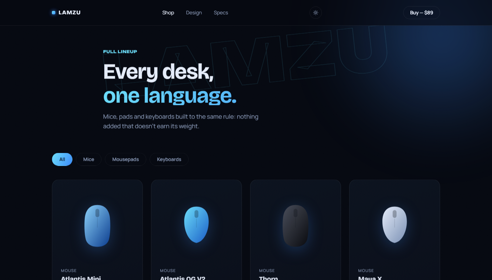

# MKZV Projects

A growing collection of front-end site projects and design studies — landing pages, product pages, small web apps. Each project lives in its own folder below, self-contained with no shared build step.

---

## [lamzu-site](./lamzu-site) — Lamzu Atlantis Mini

Apple-style concept product page for a fictional wireless gaming mouse. Every visual is hand-drawn SVG — no stock photography, no scraped product images.



**Highlights**
- Pinned scrollytelling "anatomy" section (shell → sensor → battery) with a sticky, reactive illustration
- Animated spec counters, magnetic buttons, cross-document view-transitions between pages
- Light/dark theme toggle with system-preference detection and no flash-of-wrong-theme
- Filterable shop catalog with a native `<dialog>` quick-view modal



**Stack:** HTML · CSS · JavaScript — zero dependencies, zero build step.

**Run locally:**
```bash
cd lamzu-site
python -m http.server 8000
# open http://localhost:8000
```

---

## Adding a new project

1. Create a new top-level folder, e.g. `my-new-site/`
2. Keep it self-contained (its own `index.html`, `css/`, `js/`)
3. Add a section to this README following the pattern above — a screenshot in `assets/`, a short description, the stack, and how to run it locally
